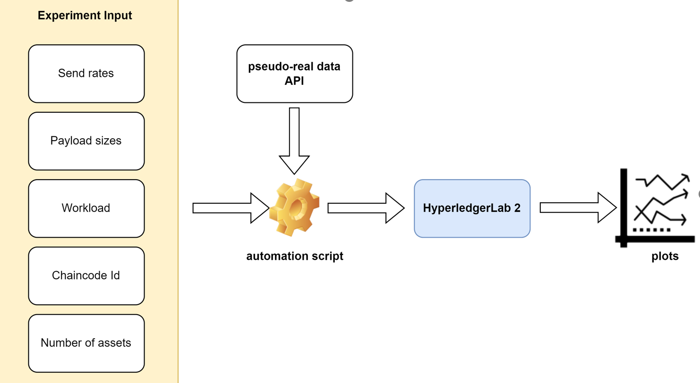

## Experiments automation
This directory includes scripts which are intended to automate the developed chaincodes benchmarking process and to plot the obtained results from Hyperledger Caliper logs.

## Example: usage of pharmaWorker on HyperledgerLab2. (instructions should be applied for every experiment worker)

1. place the `pharmaWorker.sh` and  `watchHelper.sh` script into your `\home` directory
2. run both scripts: `source pharmaWorker` and  `source watcherHelper.sh` 
3. the results can be plotted using the plotting module

**Note: the current script conducts an experiment with 10 companies and 20 variety of drugs and a total. Those parameters can be changed under the /benchmarks/pharmaceutical-supplychain/helpers/generateCompaniesAndDrugs.sh. The experiment is assessing the "createPrivateOrder" function. For the rest of the use cases, please use the corresponding worker.**

## License
[MIT](https://choosealicense.com/licenses/mit/)
